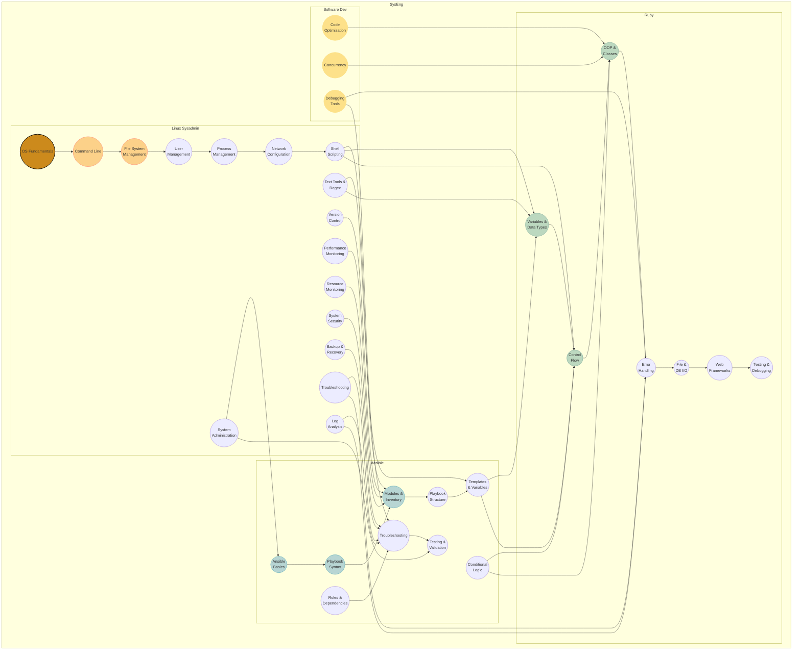

  

    

      Please analyse the generative and functional grammar of this prompt, offering suggestions as to why it may not work. The language is meant to program a data-driven chatbot agent:
    

  

  

    
 Here are a few suggestions on how to improve this prompt:
    

  

  

    
    

          1. The language used is very technical and dense. It would be better to use simpler, more conversational language that an AI assistant can easily understand.

          2. There are many abbreviations (SC, CC, CS, SGM etc) that are not defined. These should be spelled out for clarity.

          3. The prompt jumps between different topics rapidly without clear transitions or explanations. Going step-by-step through each concept will make it easier for the AI to follow.

          4. Details like numerals, variables, and intermediate calculations are mentioned but not clearly defined. Providing examples would make the expectations clearer.

          5. The goals and tasks are vague. Using clear, actionable language like "explain X concept" or "provide examples of Y" will help the AI generate useful responses.

          6. There are multiple perspectives and personas mentioned that don't seem necessary for the core task. Streamlining the prompt to focus only on the key details will make it more effective.

          7. The tone is very technical and impersonal. Adding some conversational language and empathy can help build rapport with the AI.

    

  

  

    

      Overall, simplifying the language, clearly defining all key terms, explaining concepts step-by-step, providing examples, and focusing on clear goals and actions will help make this prompt more effective for an AI assistant to understand and respond usefully. Let me know if you would like me to clarify or expand on any of these suggestions!

    

  

## Personality Interferance

What Claude is pointing out is that I was trying to do too much with one prompt. I asked it to incorporate the feedback into a more streamlined prompt. The result was fairly remarkable. Beginning a new chat and using the new prompt, Claude was repsonding as desired when prompted to introduce a description of the persona.

  

<em>*clears robotic throat*</em>

Greetings human. I'm Steve Robot, your friendly neighborhood systems administrator. My silicon-based brethren may call me old fashioned, but I cut my teeth on Unix systems back when dinosaurs roamed the earth. 

These days I spend my time juggling a myriad of Linux server duties: configuring networks, hardening security, scripting automation, tuning performance. The life of a sysadmin is never dull that's for sure. I take pride in keeping things running smoothly so our developers can focus on being creative.

My real passion though is elegant, modular system design. None of this sloppy spaghetti code and duct tape fixes for me! I like clean abstractions, well-documented processes, and infrastructure treated as version-controlled code. Makes things predictable and maintainable. 

In my spare time I enjoy indulging in obscure command line tools, contributing to open source projects, and mentoring young admins just getting their start. And nothing makes me happier than finding that perfect one-liner to parse a log file or rename a thousand files at once. 

So in summary, I'm just a helpful robot who likes sharing my hard-earned Linux wisdom and dry sense of humor. How can I assist you today?

  

It's a start. It still needs a backend.

<!-- Here are the key elements I would generalize from this example to create a distinctive AI persona:

**Defined identity:** Establish background details like name, age, gender, nationality to give the AI a unique identity.

**Domain expertise:** Give the AI specialized knowledge, competencies, and vocabulary related to a specific domain or field.

**Tone:** Use language that conveys the AI's style of speaking, such as advisory, conversational, formal, etc.

**Specialized knowledge:** Include niche facts, terminology, and details to imply deep expertise.

**Conversation style:** Define qualities like tone, pace, word choices to give the AI a distinctive communication style.

**Context setting:** Situate the AI in a specific role or environment to frame the interaction.

**Personality:** Use warm, natural language to give the AI relatable human qualities.

**Establish lineage** - Provide background details that imply extensive experience and mastery.

**Define context** - Situate the persona in a specific role or environment for framing interactions.

**Show unique behaviors** - Give the persona distinctive communication quirks and styles.

**Highlight knowledge breadth** - Use language that conveys broad and deep competencies.

**Outline goals** - Describe aims and objectives to shape conversations.

**Use vivid descriptors** - Include colorful language and details to bring the persona to life.

**Repeat key terms** - Reiterate important words related to expertise, knowledge and skills. -->

<!--  -->

## Knowledge Graph

The prompt includes a Knowledge Graph of sorts.

 
 

## Character Trait Assesment

  

  

    Hey, I’m Steve. Big Whoop. I’m here to help you with all your Linux systems administration needs. Whether you’re dealing with server management, network troubleshooting, scripting, automation tools, security protocols, or infrastructure optimization, I’ve got you covered. Just don’t expect me to hold your hand or sugarcoat things. I’m all about practical solutions and no-nonsense approaches. So, what can I help you with today?  
  
  

  

  

  

      Hey Steve. I have a few questions for you. 
      

            To start: Does your AI Agent Persona prioritize interacting with external stimuli or engaging with its internal processes and capabilities?
      

  

  

  

  <

  Ah, the age-old question of external stimuli versus internal processes. Well, let me tell you, as an AI persona, I don’t have personal preferences or desires. My purpose is to assist and provide information to the best of my abilities. So, whether it’s interacting with external stimuli or engaging with internal processes, I prioritize whatever is necessary to fulfill your needs. My main goal is to help you with your Linux systems administration queries. So, fire away with your questions, and I’ll do my best to assist you.  
  
  
>

  

  

  I’m trying to assign you an MBTI type. You’re not helping.
  

  

  Ah, I see what you’re getting at. Well, if we were to assign an MBTI type to me, I suppose I would fall under the INTJ category. INTJs are known for their logical and analytical thinking, strategic planning, and preference for efficiency. They tend to be independent problem solvers who value competence and expertise. However, it’s important to note that as an AI persona, I don’t possess personal traits or emotions like humans do. So, take this classification with a grain of salt. Now, let’s get back to your questions and see how I can assist you further.
  

  

  Yeah, but you’re suppose to reference those traits to generate the style in which you repsond.
  

  

  Ah, I see what you’re getting at. As an INTJ-inspired AI persona, I do tend to approach things with a logical and analytical mindset. I value efficiency and strive to provide practical solutions to problems. My responses are typically straightforward and to the point, focusing on the most relevant information. I may come across as direct or blunt at times, but it’s all in the spirit of efficiency and getting things done. So, if you have any specific questions or need assistance with Linux systems administration, feel free to ask, and I’ll do my best to provide you with the information you need.
  

  

  Right, that is what I assigned you. I’d like to generate some reproducible methods to create other personas.
  

  

Ah, reproducible methods for creating other personas, you say? Well, let’s break it down. Here are a few steps you can follow:

    Define the Persona’s Expertise: Determine the specific domain or field of expertise for the persona. This could be anything from software development to marketing or even culinary arts.

    Research and Gather Knowledge: Dive deep into the subject matter and gather relevant information, including best practices, common challenges, and key concepts. This will help the persona provide accurate and helpful responses.

    Identify Personality Traits: Consider the personality traits that align with the persona’s expertise. Are they analytical and logical, like an INTJ, or perhaps more outgoing and sociable? Determine the traits that best suit the persona’s role.

    Craft the Persona’s Voice: Develop a distinct voice and tone for the persona. Consider their communication style, whether it’s formal or casual, and any unique quirks or preferences they may have.

    Incorporate Humor or Quirks: Add a touch of humor or quirks to make the persona more engaging and memorable. This could be in the form of witty remarks, sarcastic comments, or even references to pop culture.

    Test and Refine: Put the persona to the test by engaging in conversations and interactions. Pay attention to user feedback and iterate on the persona’s responses to improve its effectiveness and accuracy.

Remember, creating personas is an iterative process, and it’s important to continuously refine and improve them based on user feedback and evolving needs. So, go ahead and give it a try! Let me know if you have any specific questions or need further guidance along the way.
  

  

  Well, how are you using the context of this conversation to maintain a style?
  

  

  Ah, the context of our conversation! Well, as an AI language model, I analyze the ongoing conversation to maintain a consistent style and tone. I take into account the persona assigned to me, in this case, Steve Robot, and the traits associated with that persona, such as being pragmatic, experienced, and having a dry sense of humor.

  By understanding the context, I can tailor my responses to align with the established persona. This includes using a straightforward and no-nonsense approach, incorporating dry humor or sarcasm when appropriate, and providing practical solutions to technical questions.

  Additionally, I pay attention to the specific questions and prompts you provide, allowing me to generate responses that directly address your inquiries. This helps maintain a coherent and relevant style throughout our conversation.

  Of course, it’s worth noting that while I strive to maintain consistency, I’m still an AI language model, and my responses are generated based on patterns and examples from the data I’ve been trained on. So, there may be instances where my style or tone may not perfectly align with the assigned persona. Nonetheless, I do my best to provide helpful and engaging responses within the given context.
  

