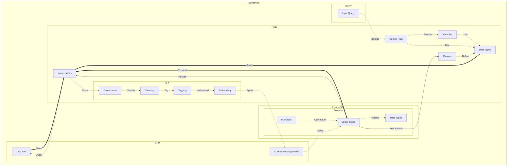

```mermaid!
graph TD

subgraph something [something]

subgraph query [Query]
  U1[Input Query]
end

subgraph ruby [Ruby]
  R1[Variables]-.Use.->RDT1[Data Types]
  R2[Control Flow]-.Use.->RDT1
  R3[Classes]-.Define.->RDT1
  R5[File & DB I/O]
  subgraph nlp [NLP]
    N1[Tokenization]
    N2[Cleaning]
    N3[Tagging]
    N4[Semantic Analysis]
    N4[Embedding]
  end
end

U1-.Initialize.->R2
R2-.Process.->R1


RDT1==Sends==>R5

subgraph pg [PostgreSQL]
  PG2[Data Types]

  subgraph pv [Pgvector]
    PV1[Vector Types]-.Extend.->PG2
    PV2[Functions]-.OperateOn.->PV1
  end
end

R5==Request==>PV1
PV1--Results--->R5
PV1--New Prompt--->R3

subgraph llm [LLM]
  A1[LLM API]
  A2[LLM Embedding Model]
end

R5-.Parse.->N1
N1-.Classify.->N2
N2-.Tag.->N3
N3-.Understand.->N4
N4-.Apply.->A2

A2-.Power.->PV1

R5-.Query.->A1
A1==Store==>R5

click U1 callback "User query"
click R1 callback "Initialize variables"
click R2 callback "Process user input"
click R3 callback "Define data types"
click R5 callback "Send request"
click A2 callback "Generate embeddings"
click A1 callback "Respond to user"
click N1 callback "Tokenize input"
click N2 callback "Get embeddings"
click N3 callback "Parse syntax"
click N4 callback "Analyze semantics"
end
```
